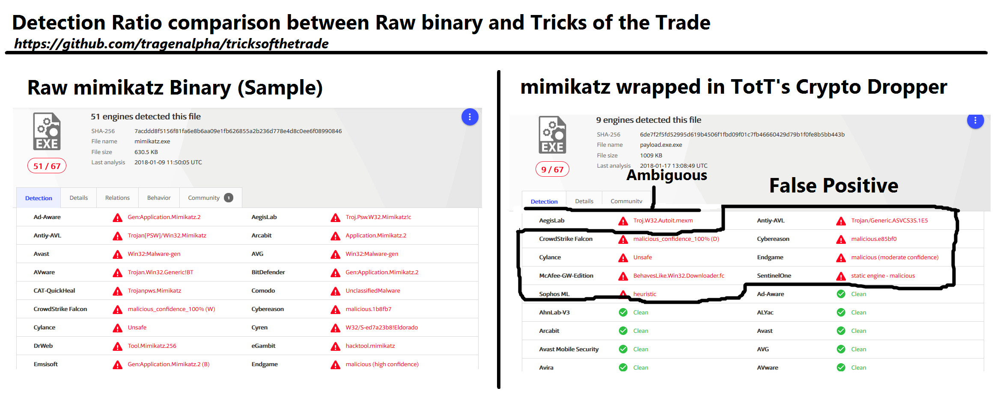

## Tricks of the Trade - <i>Crypto File Dropper to bypass file detection.</i>
---
##### <a href="https://github.com/tragenalpha/tricksofthetrade/releases"> Looking for binaries? </a>
---
##### <b>Developed by TRAGENALPHA</b>  | tragenalpha@protonmail.com
###### //beartrap Softwares (c) 2018

##### Software is licensed under the <i><b>dbad Public License</b></i>. More information: <i><a href="https://www.dbad-license.org/"> https://www.dbad-license.org/</a></i>
---
### <b>Disclaimer:</b>
* This software will not guarantee a FUD status.
* The user is responsible on how this software is used or the intention of use.
* Arguments that are given to the carrier are passed to the embedded executable
* The original executable is fully untouched and is later dropped and executed. This will mostly be useful to bypass online / network scanners
* Only executable binaries are allowed to be imported (*.exe)
* Decrypted executable is dropped in the common temporary folder
* software comes bundled with aghanim's scepter provided by a weird pink midget

---
### Hash:
* MD5: 099ab18787b92d305352cbb283364e10
* SHA-1: 62ac49668b8e1be5451965a8834fe33dca498249
* SHA-256: 837bfc3760ff1fda41ad44c4e4aef7c48fb5c7be1e36428de596e5fde549d88b
* SHA-512: 7ea238d8fc532d3a9f689c8d74de747cc70abb1163aeefb94d758c4fec04a15c4b4f5fb8a204801abd20937a2b974002981cf75a2ac2f6823dd87e9025c2dd1c
---
### Detection Ratio

---
<pre>
Encrypts your binary file and embeds them to a Crypto file dropper to bypass detection.

Usage: tott.exe [mode] -e [encryption] -a [architecture] -ico [file] -i [file in] -o [file out] -kl [integer] -requireadmin
 * [mode] should always be the first argument given

[mode] :: Sets the mode of the application
--help :: shows the help dialogue
--load  :: Encrypt and load a file
--cleanup :: clear up space by deleting all the temporary files

[load arguments]
-i [file in] :: File path of the file to be loaded and encrypted
-e [encryption] :: Encryption to use :: 3des, aes128, aes192, aes256, des, rc2, rc4 :: Default encryption aes128
-o [file out] :: File output destination after encryption and file load process
-a [architecture] :: Compiled executable architecture :: x86, x64 :: Default architecture x86
-ico [file] :: Compiled executable icon :: Default icon [blank icon]
-kl [integer] :: Key length to be used for the encryption :: Default length 64
-requireadmin :: Flags the compiled application to require administrative priviledges
</pre>